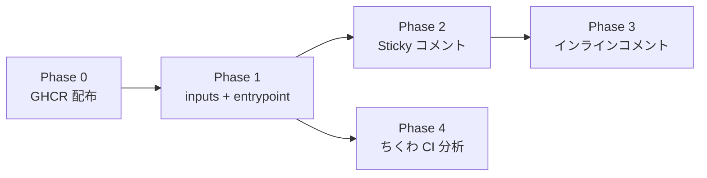

# プラン: DevInu アップグレード — claude-code-action 並みのレビュー体験

**プラン ID:** 003-devinu-upgrade
**作成日:** 2026-04-12
**ステータス:** 完了

---

## プロジェクト概要

DevInu の PR レビュー体験を claude-code-action（Anthropic 公式）並みに引き上げる。インラインコメント、Sticky コメント、CI 失敗ログ分析、GHCR 配布の 4 機能を追加し、スクリュードライバー（社内 CI）+ GHE 環境でも動作する Docker ベースのレビューツールを実現する。

## 目標

- diff 行に suggestion 付きインラインコメントを投稿（ワンクリック修正可能）
- Sticky コメントで PR コメント欄を汚さない（1 つのコメントを upsert 管理）
- CI 失敗ログを自動分析する新メンバー「ちくわ」を追加
- Docker イメージを GHCR に配布して毎回ビルドを回避
- action.yml inputs でカスタマイズ可能にする
- GHE 環境に対応する

## 関連ドキュメント

- **仕様書:** `.claude/spec-architect/001-devinu-upgrade/spec.md`
- **設計書:** `.claude/spec-architect/001-devinu-upgrade/design.md`
- **レビューレポート:** `.claude/spec-architect/001-devinu-upgrade/review-report.md`
- **ヒアリング記録:** `.claude/spec-refiner/001-devinu-upgrade/hearing.md`

## 技術スタック

- **コンテナ:** Docker (`node:22-slim`)
- **ランタイム:** Claude Code CLI (`@anthropic-ai/claude-code`)
- **GitHub 操作:** `gh` CLI + GitHub REST API（`GITHUB_TOKEN` 認証）
- **成果物:** Markdown (SKILL.md, agent .md) + Bash (entrypoint.sh) + YAML (action.yml, workflows) + Dockerfile
- **レジストリ:** GHCR (`ghcr.io/spherestacking/devinu`)

---

## フェーズ一覧

| # | 名前 | ステータス | 複雑度 | ドキュメント |
|---|------|----------|--------|------------|
| 0 | Docker イメージ GHCR 配布 | 完了 | 低 | [phase-0-ghcr-publish.md](phases/phase-0-ghcr-publish.md) |
| 1 | action.yml inputs + entrypoint.sh 強化 | 完了 | 中 | [phase-1-inputs-entrypoint.md](phases/phase-1-inputs-entrypoint.md) |
| 2 | Sticky コメント + トラッキング | 完了 | 高 | [phase-2-sticky-comment.md](phases/phase-2-sticky-comment.md) |
| 3 | インラインコメント | 完了 | 高 | [phase-3-inline-comments.md](phases/phase-3-inline-comments.md) |
| 4 | ちくわ（CI 分析）追加 | 完了 | 中 | [phase-4-chikuwa.md](phases/phase-4-chikuwa.md) |

## 依存関係グラフ

Phase 0 → 1 → 2 → 3 は直列依存。Phase 4 は Phase 1 完了後に独立して実行可能（Phase 2, 3 と並行可能だが、統合パイプラインの観点からは 3 → 4 の順序が安全）。

---

## 横断的な懸念事項

### セキュリティ
- `ANTHROPIC_API_KEY` / `GITHUB_TOKEN` はコンテナ起動時の環境変数（Docker イメージに焼き込まない）
- agent が secrets を発見しても全文引用しない（事実のみ報告）
- ちくわは CI ログ内の secrets を転記しない
- `--permission-mode bypassPermissions` は Docker サンドボックス内のみ

### コスト管理
- `--max-budget-usd` で上限制御（デフォルト $5、inputs で設定可能）
- agent エラー時はリトライなし（コスト保護）
- ちくわはデフォルト無効（ENABLE_CI_ANALYSIS=false）

### GHE 対応
- `GITHUB_SERVER_URL` から `GHE_HOST` を抽出
- 全 `gh api` 呼び出しに `--hostname $GHE_HOST` を付与
- `example-devinu.yml` に `actions: read` 権限を追加

### 命名規則
- 犬名表記: ひらがな統一（しょくぱん、もっぷ、わたあめ、べこ、わわち、ちくわ）
- agent ファイル名: ローマ字.md（shokupan.md, chikuwa.md）
- 環境変数: UPPER_SNAKE_CASE
- inputs キー: snake_case
- Docker タグ: semver + latest
