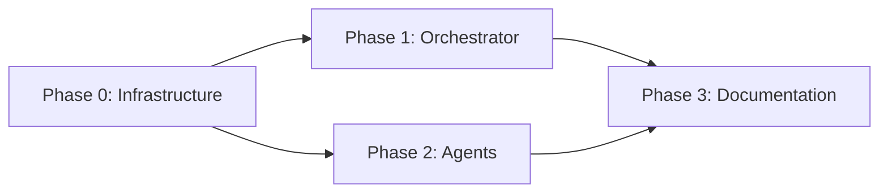

# プラン 004: Chollows リブランディング

**作成日:** 2026-04-14
**設計書:** `.claude/spec-architect/003-chollows-rebranding/design.md`
**仕様書:** `.claude/spec-refiner/003-chollows-rebranding/hearing.md`

## プロジェクト概要

リポジトリ `SphereStacking/DevInu` を `SphereStacking/Chollows` にリブランディング。犬5匹 → お化け動物6匹、おやかた → Claude 統合役に全面切り替え。Confidence スコア・`.chollows/` 拡張性・PR ディスクリプションレビュー等の新機能を含む。

## 目標

- プロダクト名・キャラクター・世界観の全面刷新
- 6匹の agent プロンプトを Confidence スコア・4段階プロセスで強化
- SKILL.md オーケストレーターの全面再設計
- `.chollows/` による対象リポジトリからのカスタマイズ機構
- CI 分析（ちくわ）と pr-review-toolkit 統合の廃止

## フェーズ一覧

| フェーズ | 名前 | ステータス | ドキュメント |
|---------|------|----------|------------|
| 0 | Infrastructure & Plugin Structure | 完了 | [phase-0-infrastructure.md](phases/phase-0-infrastructure.md) |
| 1 | Orchestrator SKILL.md | 完了 | [phase-1-orchestrator.md](phases/phase-1-orchestrator.md) |
| 2 | Agent Prompts | 完了 | [phase-2-agents.md](phases/phase-2-agents.md) |
| 3 | README & Documentation | 完了 | [phase-3-documentation.md](phases/phase-3-documentation.md) |

## 依存関係グラフ

## 横断的な懸念事項

- **DevInu 参照の完全除去:** 全フェーズで `devinu` / `DevInu` / `おやかた` / 旧犬名の参照を除去。フェーズ 3 で最終確認。
- **Docker ビルド成功:** 各フェーズ完了後に `docker build -t chollows .` が通ることを確認。
- **出力フォーマットの一貫性:** SKILL.md（フェーズ 1）が期待する agent 出力フォーマットと agent.md（フェーズ 2）の実際の出力が一致すること。
- **Confidence スコアの精度:** 運用開始後 2 週間で評価・調整予定（M-003）。
