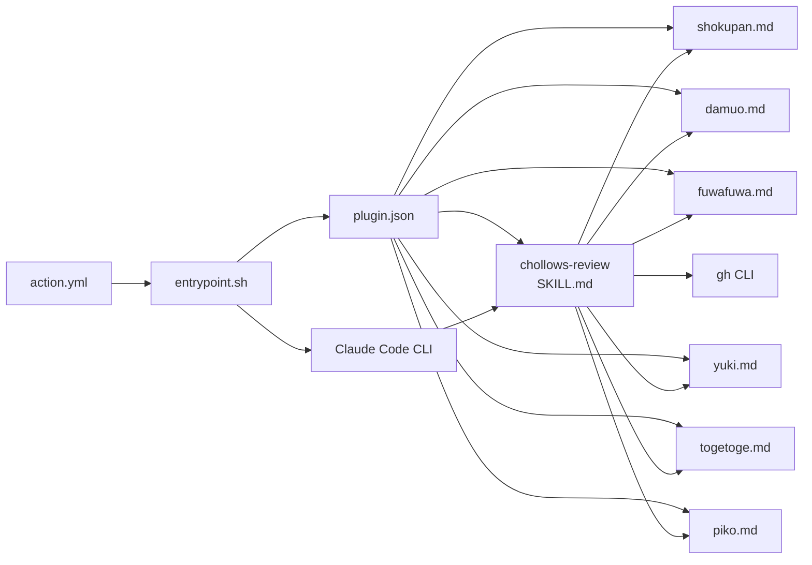
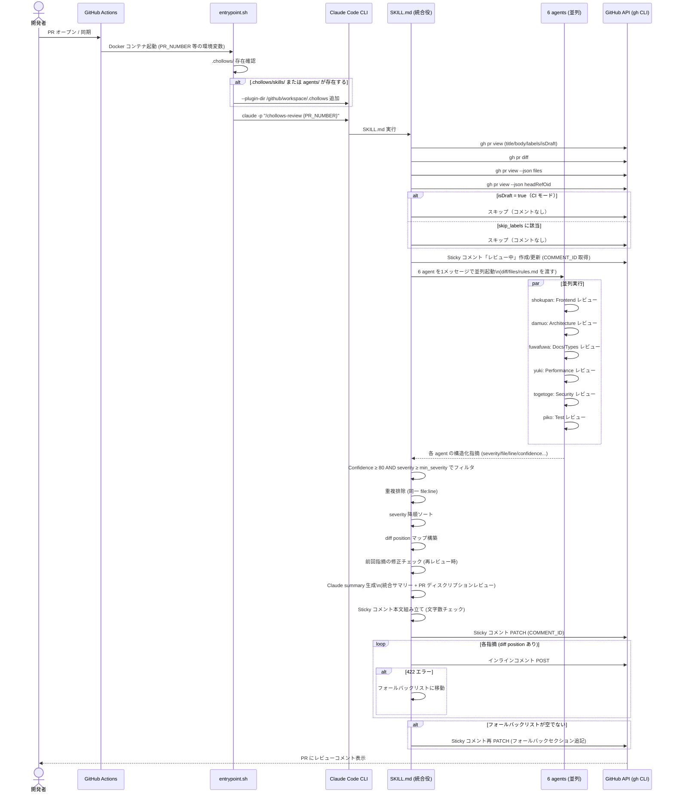
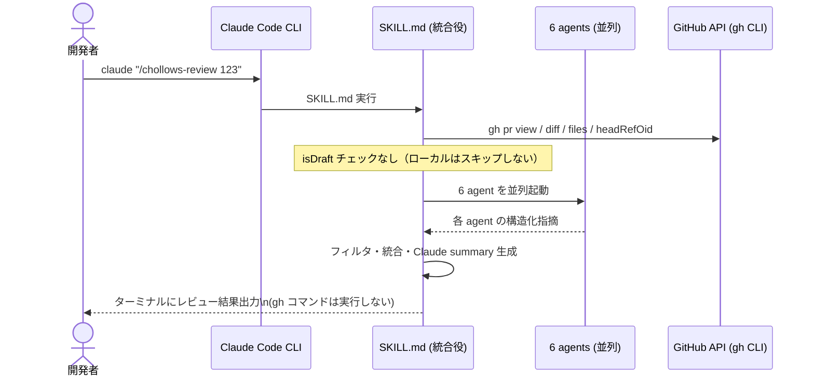
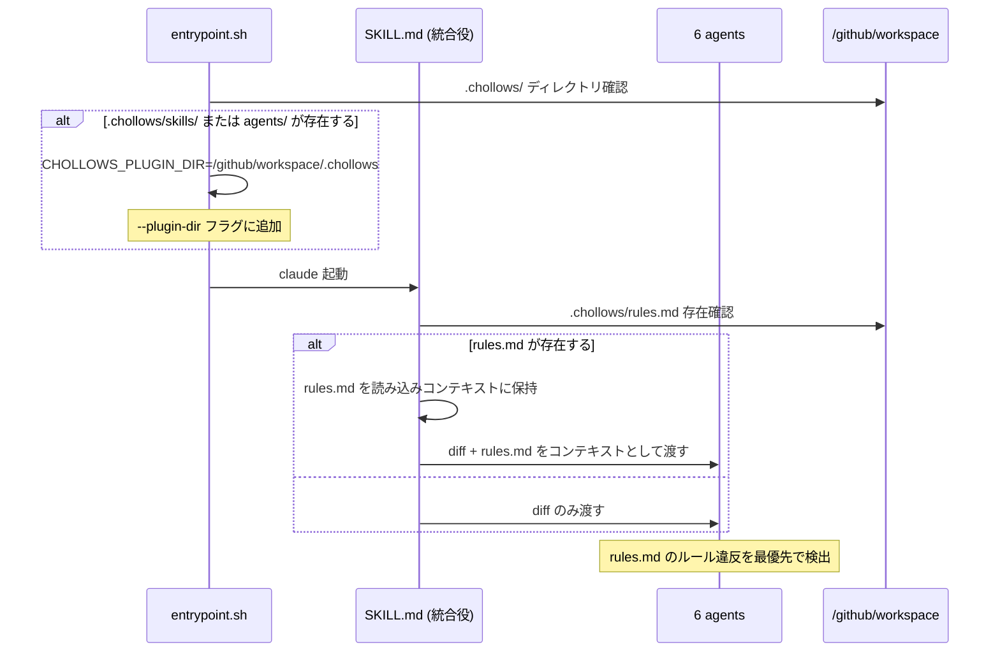
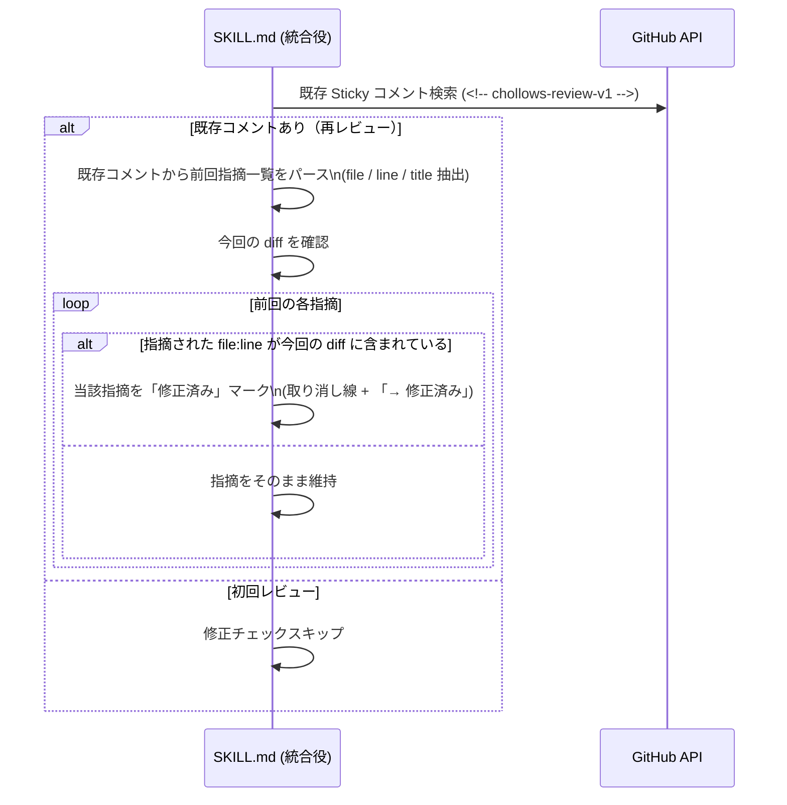

# Chollows 詳細設計書

**作成日:** 2026-04-14
**対象仕様書:** `.claude/spec-refiner/003-chollows-rebranding/hearing.md`
**レビューレポート:** `.claude/spec-architect/003-chollows-rebranding/review-report.md`
**ステータス:** DRAFT

---

## 1. 概要

**目的:** リポジトリ `SphereStacking/DevInu` を `SphereStacking/Chollows` にリブランディングし、キャラクター設計・ブランド・機能を全面刷新する。社内プロダクトとの名称衝突を解消しつつ、「墓場に棲む6匹のお化け動物がコードをレビューする」という独自の世界観を確立する。Claude API + GitHub Actions による PR 自動レビュー Bot として、プロフェッショナルなレビュー品質はそのままに、キャラクターを介することで PR の場を明るくすることを目標とする。

**スコープ:**

含むもの:
- プロダクト名・リポジトリ名・Docker イメージ名の全面変更（DevInu → Chollows）
- お化け動物6匹のキャラクター設計と agent プロンプト（旧5犬を6匹に再設計）
- オーケストレーター（旧おやかた → Claude 統合役）の SKILL.md 全面再設計
- `action.yml`・`Dockerfile`・`entrypoint.sh` の Chollows 対応
- `.chollows/` による拡張性機構（`rules.md`・カスタムスキル読み込み）
- Sticky コメント構成の変更（マーカー・フォーマット）
- Confidence スコア機構の導入（全 agent 共通）
- PR ディスクリプションレビュー機能（Claude 統合役が担当）
- `disabled_agents` による特定エージェント無効化
- 再レビュー時の修正済み判定と取り消し線付与

含まないもの:
- CI 分析機能（ちくわ）— 廃止
- pr-review-toolkit 統合 — 廃止（観点を6匹に吸収）
- アイコン画像の生成（設計範囲外・別タスク）
- DB / バックエンド API（本プロジェクトには存在しない）
- DevInu との後方互換性（全面切り替え）

**前提条件:**
- 利用者は GitHub Actions が利用可能な GitHub リポジトリを持つ開発チームである
- `ANTHROPIC_API_KEY` が GitHub Secrets または環境変数として設定済みである
- `GITHUB_TOKEN` が GitHub Actions のデフォルトトークンとして利用可能である
- Docker コンテナ内で Claude Code CLI を root 以外のユーザーで実行する必要がある（Claude Code が root での `bypassPermissions` を拒否するため）
- Claude Code のプラグインシステムにおいて `--plugin-dir` フラグで複数のプラグインを起動時に追加できる
- GitHub Actions 実行時、対象リポジトリは `/github/workspace` にマウントされ、`CLAUDE.md` や `.chollows/` が自動的に読み込まれる

**用語定義:**

| 用語 | 定義 |
|------|------|
| Chollows | 本プロダクトの名称。Claude + Hollows（空洞/お化け）の造語。読みは「チョロウズ」 |
| お化け動物 | Chollows を構成する6匹のレビュー担当キャラクター。下半身が幽霊尻尾の動物たち |
| Claude 統合役 | 旧「おやかた」に相当するオーケストレーター。キャラクター化はせず Claude API そのものとして扱う |
| agent | Claude Code のエージェント機能で起動される各お化け動物のレビュー担当プロセス |
| SKILL.md | Claude Code プラグインにおけるスキル定義ファイル。オーケストレーターのプロンプト |
| agent.md | Claude Code プラグインにおける agent 定義ファイル。各お化け動物のプロンプト |
| Sticky コメント | PR に対して1件だけ更新し続けるレビュー結果コメント。HTML マーカーで識別 |
| Confidence スコア | 各 agent が指摘に付与する確信度（0〜100）。80 以上のみ報告対象 |
| min_severity | 表示する最低 severity（critical / high / medium / low） |
| `.chollows/` | 対象リポジトリに配置するカスタマイズ用ディレクトリ |
| `rules.md` | `.chollows/` 配下に置くプロジェクト固有レビュールールファイル |
| disabled_agents | action.yml パラメータ。ID 指定で特定 agent を無効化する |
| diff position | GitHub PR インラインコメント投稿のための unified diff 内オフセット値 |
| bypassPermissions | Claude Code CLI の権限モード。プロンプト確認なしで実行する |

---

## 2. システムアーキテクチャ

**技術スタック:**

| カテゴリ | 技術 | 選定理由 |
|---------|------|---------|
| コンテナ | Docker (node:22-slim ベース) | Claude Code CLI が Node.js 製のため、既存構成を踏襲 |
| CI 実行基盤 | GitHub Actions (docker action) | 対象リポジトリの PR イベントで自動起動するための標準的な方式 |
| LLM 実行エンジン | Claude Code CLI (`@anthropic-ai/claude-code`) | プラグイン・エージェント並列起動・バジェット制御を提供する既存構成 |
| VCS 操作 | gh CLI | PR 情報取得・コメント投稿に使用。既存構成を踏襲 |
| プラグイン形式 | Claude Code プラグイン (`plugin.json` + SKILL.md + agent.md) | ローカル利用とCI利用の両形態をサポートする既存機構 |
| シェルスクリプト | Bash | `entrypoint.sh` による起動制御。既存構成を踏襲 |

**全体構成図:**

```mermaid
graph TB
    subgraph "GitHub Actions / ローカル"
        PR[PR イベント / ローカル呼び出し]
    end

    subgraph "Docker コンテナ (ghcr.io/spherestacking/chollows)"
        ES[entrypoint.sh]
        subgraph "Claude Code CLI"
            SK[chollows-review SKILL.md\n Claude 統合役]
            subgraph "並列 Agent 起動"
                A1[shokupan\nFrontend]
                A2[damuo\nArchitecture]
                A3[fuwafuwa\nDocs/Types]
                A4[yuki\nPerformance]
                A5[togetoge\nSecurity]
                A6[piko\nTest]
            end
        end
    end

    subgraph "対象リポジトリ (ワークスペース)"
        WS[/github/workspace]
        CH[.chollows/\nrules.md / skills/]
        CM[CLAUDE.md]
    end

    subgraph "GitHub API"
        GH_PR[gh pr view / diff]
        GH_CMT[gh api - comment POST/PATCH]
    end

    PR --> ES
    ES -->|--plugin-dir| SK
    ES -->|.chollows/ があれば --plugin-dir 追加| CH
    SK --> A1 & A2 & A3 & A4 & A5 & A6
    SK -->|gh コマンド| GH_PR
    SK -->|gh コマンド| GH_CMT
    WS --> SK
    CH --> SK
    CM --> SK
```

**レイヤー構成:**
- **実行制御レイヤー (`entrypoint.sh`):** 環境変数の検証・デフォルト値設定・`.chollows/` 検出と `--plugin-dir` 動的追加・Claude Code CLI 起動
- **オーケストレーションレイヤー (`SKILL.md`):** PR 情報収集・スキップ判定・agent 並列起動・結果統合・出力フォーマット・コメント投稿
- **レビューレイヤー (各 agent.md):** 専門観点でのレビュー実施・Confidence スコア付与・構造化出力
- **外部連携レイヤー (gh CLI):** GitHub PR API 操作（diff 取得・コメント投稿）

---

## 3. API 設計

**該当なし（理由）:** 本プロジェクトは Web API サーバーを持たない。外部との通信インターフェースは GitHub Actions の `action.yml` パラメータ（入力）と GitHub PR コメント（出力）のみである。REST API エンドポイント・認証フロー・リクエスト/レスポンス定義は不要。

ただし、本プロジェクトが内部で呼び出す GitHub API の操作を以下に記録する。

**使用する GitHub API 操作（gh CLI 経由）:**

| 操作 | gh コマンド | 用途 |
|------|-----------|------|
| PR 情報取得 | `gh pr view $PR_NUMBER --json title,body,author,labels,isDraft,number` | スキップ判定・コメントヘッダー生成 |
| PR diff 取得 | `gh pr diff $PR_NUMBER` | 各 agent へ渡す diff 本文 |
| PR ファイル一覧取得 | `gh pr view $PR_NUMBER --json files --jq '.files[].path'` | 変更ファイル一覧 |
| HEAD commit SHA 取得 | `gh pr view $PR_NUMBER --json headRefOid --jq '.headRefOid'` | インラインコメントの commit_id |
| 既存コメント検索 | `gh api /repos/{repo}/issues/{pr}/comments` | Sticky コメント ID 特定 |
| Sticky コメント作成 | `gh api --method POST /repos/{repo}/issues/{pr}/comments` | 初回投稿 |
| Sticky コメント更新 | `gh api --method PATCH /repos/{repo}/issues/comments/{id}` | 結果上書き |
| インラインコメント投稿 | `gh api --method POST /repos/{repo}/pulls/{pr}/comments` | diff 行へのコメント |

**`action.yml` 入力インターフェース（CLI パラメータ設計）:**

| パラメータ | 型 | 必須 | デフォルト | 説明 |
|-----------|-----|------|-----------|------|
| `anthropic_api_key` | string | 必須 | — | Anthropic API キー |
| `min_severity` | string | 任意 | `medium` | 表示する最低 severity（critical/high/medium/low） |
| `max_budget_usd` | string | 任意 | `5` | API コスト上限（USD） |
| `language` | string | 任意 | `ja` | レビュー言語 |
| `disabled_agents` | string | 任意 | — | 無効化する agent ID（カンマ区切り） |
| `skip_labels` | string | 任意 | `skip-chollows` | スキップ用ラベル（カンマ区切り） |

---

## 4. DB スキーマ設計

**該当なし（理由）:** 本プロジェクトはデータベースを持たない。状態はすべて GitHub PR コメント（Sticky コメントの HTML body）と環境変数で管理される。永続化データ・テーブル定義・インデックス・マイグレーション手順はいずれも不要である。

---

## 5. コンポーネント設計

**コンポーネント一覧:**

| コンポーネント | 責務 | 依存先 |
|-------------|------|--------|
| `entrypoint.sh` | 環境変数検証・デフォルト値設定・`.chollows/` 検出・Claude Code CLI 起動 | Claude Code CLI、gh CLI |
| `action.yml` | GitHub Actions インターフェース定義。入力パラメータを環境変数に変換 | `entrypoint.sh`（Docker エントリーポイント） |
| `Dockerfile` | コンテナイメージ定義。Node.js・gh CLI・Claude Code CLI・プラグインを含む | Docker Hub (node:22-slim) |
| `SKILL.md` (chollows-review) | オーケストレーター。PR 情報収集・agent 並列起動・結果統合・出力 | 6 agent.md、gh CLI |
| `shokupan.md` | Frontend レビュー agent（コーギー / しょくぱん） | — |
| `damuo.md` | Architecture & Code Quality レビュー agent（ビーバー / だむお） | — |
| `fuwafuwa.md` | Docs / Types / API レビュー agent（チンチラ / ふわふわ） | — |
| `yuki.md` | Performance & Data レビュー agent（シマエナガ / ゆき） | — |
| `togetoge.md` | Security レビュー agent（ハリネズミ / とげとげ） | — |
| `piko.md` | Test Quality レビュー agent（メンダコ / ぴこ） | — |
| `plugin.json` | Claude Code プラグイン登録ファイル | SKILL.md、全 agent.md |

**インターフェース定義:**

```
entrypoint.sh:
  - 入力: 環境変数（GITHUB_TOKEN, ANTHROPIC_API_KEY, GITHUB_REPOSITORY, PR_NUMBER,
           MAX_BUDGET_USD, MIN_SEVERITY, LANGUAGE, DISABLED_AGENTS, SKIP_LABELS）
  - 処理: .chollows/ ディレクトリ検出 → --plugin-dir 動的追加
  - 出力: claude CLI プロセス起動（exec で置き換え）

SKILL.md (chollows-review):
  - 入力: $ARGUMENTS（PR番号）、各環境変数
  - 処理: PR情報収集 → スキップ判定 → Sticky「レビュー中」更新 →
           6 agent 並列起動 → 結果統合 → Confidence/severity フィルタ →
           Claude summary 生成 → コメント投稿
  - 出力: CI時 → Sticky コメント PATCH + インラインコメント POST
           ローカル時 → ターミナル出力

各 agent.md:
  - 入力: PR タイトル・本文・diff 全文・変更ファイル一覧・rules.md（存在する場合）・
           disabled_agents 一覧
  - 処理: 自身が disabled_agents に含まれていれば即返す →
           diff を専門観点でレビュー →
           各指摘に Confidence スコア付与
  - 出力: 構造化テキスト形式の指摘一覧（severity/file/line/title/description/suggestion/confidence）
           または「指摘なし」報告
```

**依存関係図:**



**プラグイン構造設計:**

```
plugins/chollows/
├── plugin.json               # プラグイン登録（name: chollows）
├── skills/
│   └── chollows-review/
│       └── SKILL.md          # オーケストレーター
└── agents/
    ├── shokupan.md
    ├── damuo.md
    ├── fuwafuwa.md
    ├── yuki.md
    ├── togetoge.md
    └── piko.md
```

**`plugin.json` 設計:**

```json
{
  "name": "chollows",
  "version": "1.0.0",
  "description": "Chollows - Ghost animals PR review team",
  "skills": [
    { "path": "skills/chollows-review/SKILL.md" }
  ],
  "agents": [
    { "path": "agents/shokupan.md" },
    { "path": "agents/damuo.md" },
    { "path": "agents/fuwafuwa.md" },
    { "path": "agents/yuki.md" },
    { "path": "agents/togetoge.md" },
    { "path": "agents/piko.md" }
  ]
}
```

**各 agent プロンプト設計方針（M-003 対応: Confidence スコア段階的導入）:**

Confidence スコアは初期リリースから全 agent に導入するが、フィルタ閾値（80）は調整可能とする。

全 agent 共通の出力フォーマット:

```
severity: Critical | High | Medium | Low
file: {ファイルパス}
line: {行番号}
title: {一行タイトル}
description: {説明}
confidence: {0-100の整数}
suggestion: |
  {修正後のコード（オプション）}
```

Confidence スコアの意味:
- 0-25: 誤検知の可能性大（報告しない）
- 26-50: 軽微な nitpick（報告しない）
- 51-75: 有効だが低影響（報告しない）
- 76-90: 要対応（報告する）
- 91-100: クリティカル（報告する）

各 agent のレビュープロセス（4段階）:
1. 対象ファイル特定（自身の担当拡張子・パターンに該当するファイルを diff から抽出）
2. パターン検出（担当観点のアンチパターン・チェックリストに照らし合わせる）
3. 評価（severity と confidence スコアを付与）
4. 出力（構造化形式で報告。該当なしの場合は「指摘なし」を返す）

**agent 別専門チェックパターン（主要項目）:**

| agent | ID | チェックパターン例 |
|-------|-----|-----------------|
| しょくぱん | shokupan | 不要な再レンダリング / aria 属性漏れ / CSS スコープ漏れ / バンドルサイズ増大 / XSS (dangerouslySetInnerHTML 等) / バンドル未最適化インポート |
| だむお | damuo | 深いネスト / 単一責任原則違反 / 空の catch ブロック / DRY 違反 / 命名の不明瞭さ / 循環参照 |
| ふわふわ | fuwafuwa | `any` 型の使用 / JSDoc 欠落 / API 契約の不整合 / 型の過度な widening / export 定義の欠落 |
| ゆき | yuki | N+1 クエリパターン / 逐次 await の並列化可能箇所 / O(n²) アルゴリズム / メモリリーク / バンドルサイズ増大 |
| とげとげ | togetoge | ハードコードされた secrets / SQL インジェクション / XSS / CSRF トークン欠落 / 認証チェック漏れ / 安全でない乱数 |
| ぴこ | piko | テストのない新規関数 / 境界値テスト欠落 / モックが過剰でテスト価値ゼロ / `it('should work')` 等の意味のないテスト名 |

**定量評価軸（M-003: 試験運用として初期リリースに含める）:**

- ぴこ (Test): 各テスト提案に criticality レーティング（1-10）
- ふわふわ (Types): 型設計の4軸評価（Encapsulation / Expression / Usefulness / Enforcement）
- だむお (Architecture): 設計品質スコア

---

## 6. データフロー

### UC-01: 通常 PR レビュー（CI モード）



### UC-02: ローカル実行



### UC-03: `.chollows/rules.md` によるカスタムルール適用



### UC-04: 再レビュー時の修正済み判定



---

## 7. ファイル構成

**ディレクトリツリー:**

```
Chollows/                            # リポジトリルート (旧: DevInu)
├── action.yml                       # GitHub Actions 定義（Chollows 対応版）
├── Dockerfile                       # コンテナイメージ定義（Chollows 対応版）
├── entrypoint.sh                    # 起動スクリプト（.chollows/ 検出追加）
├── plugins/
│   └── chollows/                    # Claude Code プラグイン本体（旧: devinu）
│       ├── plugin.json              # プラグイン登録
│       ├── skills/
│       │   └── chollows-review/
│       │       └── SKILL.md         # オーケストレーター（旧: devinu-review）
│       └── agents/
│           ├── shokupan.md          # Frontend (コーギー)
│           ├── damuo.md             # Architecture (ビーバー)
│           ├── fuwafuwa.md          # Docs/Types (チンチラ)
│           ├── yuki.md              # Performance (シマエナガ)
│           ├── togetoge.md          # Security (ハリネズミ)
│           └── piko.md              # Test (メンダコ)
├── .claude-plugin/
│   └── marketplace.json             # マーケットプレイス登録用メタデータ（更新）
└── README.md                        # Chollows 対応版

# 対象リポジトリ側（利用者が配置・Chollows 本体には含まない）
target-repo/
└── .chollows/                       # カスタマイズ用ディレクトリ（オプション）
    ├── rules.md                     # プロジェクト固有レビュールール
    └── skills/
        └── my-custom/
            └── SKILL.md             # カスタムスキル（オプション）
```

**変更対象ファイル一覧（DevInu → Chollows）:**

| ファイル | 変更種別 | 変更内容 |
|--------|--------|--------|
| `action.yml` | 更新 | name / docker image URL / input パラメータ名（skip_labels デフォルト等）|
| `Dockerfile` | 更新 | USER 名 `devinu` → `chollows`、COPY 先パス、pr-review-toolkit 削除 |
| `entrypoint.sh` | 更新 | SKIP_LABELS デフォルト・`.chollows/` 検出ロジック追加・DISABLED_AGENTS 対応 |
| `plugins/devinu/` | 削除 → 新規 | `plugins/chollows/` として全面再作成 |
| `plugins/chollows/skills/chollows-review/SKILL.md` | 新規 | おやかた → Claude 統合役として全面再設計 |
| `plugins/chollows/agents/shokupan.md` | 更新 | Confidence スコア・4段階プロセス追加 |
| `plugins/chollows/agents/damuo.md` | 新規 | Architecture & Code Quality agent |
| `plugins/chollows/agents/fuwafuwa.md` | 更新（旧 wawachi） | Docs/Types/API agent |
| `plugins/chollows/agents/yuki.md` | 更新（旧 wataame） | Performance & Data agent |
| `plugins/chollows/agents/togetoge.md` | 更新（旧 moppu） | Security agent |
| `plugins/chollows/agents/piko.md` | 更新（旧 beko） | Test Quality agent |
| `.claude-plugin/marketplace.json` | 更新 | name / description 変更 |
| `README.md` | 全面改訂 | Chollows 対応（6匹図鑑・Quick Start・Configuration・Customization）|

**命名規則:**
- ファイル: kebab-case（例: `chollows-review`）またはひらがな ID（例: `shokupan.md`, `damuo.md`）
- agent ID: ひらがなのローマ字表記（例: `shokupan`, `damuo`, `fuwafuwa`, `yuki`, `togetoge`, `piko`）
- 環境変数: UPPER_SNAKE_CASE（例: `MAX_BUDGET_USD`, `DISABLED_AGENTS`）
- Docker ユーザー名: `chollows`（非 root、Claude Code の bypassPermissions 要件を満たすため）
- Sticky コメントマーカー: `<!-- chollows-review-v1 -->`

---

## 8. エラーハンドリング

**設計方針:** Claude Code CLI の制御機構（budget 上限・タイムアウト）に委任し、独自エラーハンドリングは最小限にする（仕様確定済み）。

**エラー分類:**

| カテゴリ | 例 | 対応 | リトライ |
|---------|-----|-----|---------|
| 必須環境変数欠落 | `GITHUB_TOKEN` 未設定 | `entrypoint.sh` で即時終了（set -euo pipefail）| 不要 |
| PR 番号不正 | 数値以外の引数 | SKILL.md でエラーメッセージ出力して終了 | 不要 |
| GitHub API 失敗 | PR が存在しない・権限エラー | エラーメッセージを PR コメントに投稿して終了（初回コメント前の失敗はターミナル出力のみ） | 不要 |
| インラインコメント 422 | diff に含まれない行を指定 | フォールバックリストに移動し Sticky コメントに追記 | 不要 |
| agent タイムアウト / エラー | budget 超過・Claude API 障害 | その agent の結果を 0 件として扱い残りで続行 | 不要 |
| 巨大 diff | 数万行の diff | `gh pr diff` 出力をそのまま渡す（Claude のコンテキスト上限に任せる） | 不要 |
| コメントサイズ超過 | 60,000 文字超 | Low → Medium の順に詳細を「（詳細省略）」に圧縮 | 不要 |

**フォールバック方針:**

- **GitHub API 失敗:** リトライなし。エラーメッセージを PR コメントに投稿（Sticky コメント作成前の失敗はターミナルのみ）して終了
- **agent エラー:** 当該 agent をスキップし、残りの結果で出力。統計テーブルでは `-（エラー）` と表示
- **インラインコメント 422:** Sticky コメントの末尾フォールバックセクションに追記
- **コメントサイズ超過:** 段階的な詳細省略（Low → Medium）。Critical/High は常に保持

**`entrypoint.sh` のエラー制御:**

```bash
set -euo pipefail
# 必須環境変数チェック（欠落時は即終了）
: "${GITHUB_TOKEN:?GITHUB_TOKEN is required}"
: "${ANTHROPIC_API_KEY:?ANTHROPIC_API_KEY is required}"
: "${GITHUB_REPOSITORY:?GITHUB_REPOSITORY is required}"
: "${PR_NUMBER:?PR_NUMBER is required}"
```

---

## 9. セキュリティ設計

**認証/認可の設計:**

本プロジェクトは Web サーバーを持たないため、従来の認証/認可フロー（JWT 等）は存在しない。代わりに以下のトークンベース認証を用いる。

| 認証対象 | 方式 | 設定場所 |
|---------|------|---------|
| Anthropic API | `ANTHROPIC_API_KEY` 環境変数 | GitHub Secrets → action.yml 経由 |
| GitHub API (gh CLI) | `GITHUB_TOKEN` 環境変数 | GitHub Actions デフォルトトークン |
| GitHub Enterprise | `GITHUB_SERVER_URL` からホスト抽出 | GitHub Actions 環境変数 |

**secrets の取り扱い:**

- `ANTHROPIC_API_KEY` は Docker コンテナ内の環境変数としてのみ存在し、ログ・コメント・ファイルには一切出力しない
- `GITHUB_TOKEN` も同様にログ・コメントへの出力を禁止する
- togetoge (Security agent) が diff 内の secrets を発見した場合、コメントに secrets の全文を引用しない。「secrets が検出されました（`{ファイルパス}:{行番号}`）」という事実のみ報告する

**入力バリデーション規則:**

| 入力 | バリデーション | 処理 |
|------|-------------|------|
| PR 番号 (`$ARGUMENTS`) | 数値であること | SKILL.md の引数解析ステップで検証。数値以外はエラーメッセージ出力して終了 |
| `MIN_SEVERITY` | `critical/high/medium/low` のいずれか | 不正値の場合 `medium` にフォールバック |
| `DISABLED_AGENTS` | カンマ区切りの agent ID 文字列 | 不明な ID は無視（無効化しない） |
| `MAX_BUDGET_USD` | 数値文字列 | Claude Code CLI に渡す。不正値は CLI がエラー処理 |

**Docker セキュリティ:**

- 非 root ユーザー `chollows` で実行（Claude Code が root での `bypassPermissions` を拒否するため必須）
- コンテナ内にシークレットを COPY / ADD しない
- `--permission-mode bypassPermissions` は Claude Code CLI に対してのみ適用

**コンテナ内ファイルの権限:**

- `/chollows-plugin/` — `chollows:chollows` 所有（プラグインファイル）
- `/entrypoint.sh` — `chollows:chollows` 所有、実行権限あり
- `/github/workspace/` — GitHub Actions によりマウント（対象リポジトリ）

---

## 10. テスト戦略

**テスト種別:**

| 種別 | 対象 | ツール | 目標 |
|------|------|--------|------|
| 手動 E2E テスト | CI フロー全体（PR に実際にコメントが投稿されること）| GitHub Actions の実際の PR | 主要ユースケース UC-01〜UC-04 を手動検証 |
| ローカル動作テスト | ローカル実行フロー | Claude Code CLI + gh CLI | `claude "/chollows-review {PR番号}"` で動作確認 |
| Docker ビルドテスト | コンテナイメージのビルド成功 | `docker build -t chollows .` | ビルドエラーがないこと |
| プロンプト評価 | 各 agent の指摘精度・Confidence スコアの妥当性 | 手動評価（サンプル PR での比較） | 誤検知率 < 20%（定性評価） |

**本プロジェクトで自動テストが限定的な理由:**

本プロジェクトはシェルスクリプト + Markdown プロンプト（SKILL.md / agent.md）が主体であり、ユニットテストや統合テストの対象となるビジネスロジック（関数・クラス）が存在しない。レビュー品質はプロンプトの品質と LLM の出力に依存するため、自動テストではなく手動評価が適切である。

**テストデータ方針:**

- テスト用 PR: 実際のリポジトリに意図的な問題を含む PR を作成して検証する
- 観点別テストケース:
  - shokupan: `aria-*` 属性漏れ・型なし props を含む tsx ファイルの変更
  - togetoge: ハードコードされた API キーを含む変更
  - yuki: N+1 クエリパターンを含む変更
  - piko: テストなしの新規関数を含む変更
  - Confidence フィルタ: 明らかに問題のない変更で誤検知が起きないこと

**Confidence スコアの初期運用方針（M-003 対応）:**

- 初期リリースは全 agent で一斉導入する（試験運用フェーズ）
- 運用開始後 2 週間、実際の PR でのフィルタ結果をレビューしてスコアリングの精度を評価する
- 誤検知が多い agent については、チェックパターンを絞り込むプロンプト調整を行う

**CI テスト実行:**

- `docker build -t chollows .` はリポジトリへの push 毎に GitHub Actions で自動実行する
- 実際のレビュー動作テストはリリース前の手動検証 PR で実施する

---

## 11. 非機能要件

**パフォーマンス目標:**

| メトリクス | 目標値 | 測定方法 |
|----------|--------|---------|
| レビュー完了時間（全 agent 並列） | 3分以内（通常 PR） | GitHub Actions の job 実行時間 |
| コスト上限 | デフォルト $5 / レビュー | `max_budget_usd` パラメータで制御 |
| コメントサイズ | 60,000 文字以内 | SKILL.md 内で文字数チェック・圧縮 |

**スケーラビリティ方針:**

- **水平スケーリング:** GitHub Actions の並列 job により複数 PR の同時レビューが可能（GitHub Actions の並列実行制限に依存）
- **エージェント並列化:** 6 agent を 1 メッセージで並列起動することでレイテンシを最小化
- **コスト制御:** `max_budget_usd` により過剰なトークン消費を防止。個別 agent のタイムアウトは設けず Claude Code CLI の budget 管理に委任

**監視項目:**

| 項目 | 確認方法 |
|------|---------|
| GitHub Actions job の成功/失敗 | Actions タブのワークフロー実行ログ |
| API コスト消費 | Anthropic Console のダッシュボード |
| Sticky コメントの投稿成否 | PR コメント欄で目視確認 |
| フォールバック発生頻度 | Sticky コメント内のフォールバックセクション有無 |

**可用性方針:**

- Claude Code CLI または Anthropic API が利用不可の場合、レビューはスキップされ PR のマージは妨げない（コメントが投稿されないだけ）
- GitHub API が利用不可の場合、エラーメッセージを投稿して終了

---

## 12. 仕様トレーサビリティ

**仕様要件 → 設計セクション対応表:**

| 要件 ID | 要件概要 | 設計セクション | 設計要素 |
|---------|---------|--------------|---------|
| REQ-001 | プロダクト名を Chollows にリブランディング | 7. ファイル構成 | `plugins/chollows/`・`action.yml`・`Dockerfile`・`README.md` の全面変更 |
| REQ-002 | Docker イメージを `ghcr.io/spherestacking/chollows` に変更 | 7. ファイル構成 | `Dockerfile` の USER 名・`action.yml` の image URL 変更 |
| REQ-003 | Sticky コメントマーカーを `<!-- chollows-review-v1 -->` に変更 | 6. データフロー / 7. ファイル構成 | SKILL.md の出力テンプレート変更 |
| REQ-004 | お化け動物6匹のキャラクター設計（shokupan/damuo/fuwafuwa/yuki/togetoge/piko） | 5. コンポーネント設計 | 各 agent.md の設計。旧5犬を6匹に再設計 |
| REQ-005 | 全 agent 並列起動・各 agent が自己判定 | 6. データフロー (UC-01) | SKILL.md が 6 agent を 1 メッセージで並列起動 |
| REQ-006 | Confidence スコア導入（≥ 80 でフィルタ） | 5. コンポーネント設計 / 6. データフロー | 全 agent の出力フォーマットに confidence フィールド追加 |
| REQ-007 | Confidence × severity の AND 条件フィルタ | 5. コンポーネント設計 / 6. データフロー | SKILL.md の結果統合ステップ |
| REQ-008 | `.chollows/rules.md` による全 agent へのルール注入 | 6. データフロー (UC-03) / 5. コンポーネント設計 | SKILL.md が rules.md を読み込みコンテキストとして渡す |
| REQ-009 | `.chollows/skills/` のカスタムスキル読み込み | 5. コンポーネント設計 / 8. エラーハンドリング | `entrypoint.sh` の `.chollows/` 検出 → `--plugin-dir` 追加 |
| REQ-010 | `disabled_agents` による特定 agent 無効化 | 3. API 設計 / 5. コンポーネント設計 | `action.yml` の `disabled_agents` パラメータ。SKILL.md で ID チェック後 agent をスキップ |
| REQ-011 | Claude 統合役がキャラクター化なしで統合・Claude summary 生成 | 5. コンポーネント設計 / 6. データフロー | SKILL.md の Claude summary 生成ステップ（キャラ表現なし） |
| REQ-012 | PR ディスクリプションレビュー（薄い場合にドラフト提案） | 5. コンポーネント設計 | SKILL.md の Claude summary セクション。M-004: 本文 3 行未満または 100 文字未満の場合にドラフト提案 |
| REQ-013 | Sticky コメント構成（Critical/High → 詳細レビュー → 良い点 → 統計 → Claude summary） | 5. コンポーネント設計 | SKILL.md の出力フォーマットテンプレート |
| REQ-014 | インラインコメント投稿（diff position マッピング） | 6. データフロー (UC-01) | SKILL.md のセクション 5.5（diff position マップ構築） |
| REQ-015 | 再レビュー時の修正済み判定（file:line が今回の diff に含まれていれば修正済み） | 6. データフロー (UC-04) | M-002 対応。前回指摘の file:line と今回 diff の照合ロジック |
| REQ-016 | 再レビュー時の取り消し線付与（チェックボックスは使わない） | 5. コンポーネント設計 / 6. データフロー | SKILL.md の再レビューフロー。`~~タイトル~~ → **修正済み**` 形式 |
| REQ-017 | レビュー内容の性格バイアス排除（キャラクターは名前・アイコンのみ） | 5. コンポーネント設計 | 全 agent.md の設計方針。プロンプト本文から語尾・性格設定を一切排除 |
| REQ-018 | 文体: 敬体（〜です / 〜ます）のフラットなレビュー | 5. コンポーネント設計 | 全 agent.md に文体指定を明記 |
| REQ-019 | CI 分析機能（ちくわ）の廃止 | 7. ファイル構成 | `chikuwa.md` を新プラグインに含めない。`action.yml` から `enable_ci_analysis` パラメータを削除 |
| REQ-020 | pr-review-toolkit 統合の廃止 | 5. コンポーネント設計 / 7. ファイル構成 | `Dockerfile` から pr-review-toolkit clone を削除。観点を6匹に吸収 |
| REQ-021 | マイグレーション: 既存互換なし・全面切り替え | 7. ファイル構成 | DevInu コメントは放置。新マーカーで新規作成 |
| REQ-022 | エラーハンドリング: Claude Code CLI に委任・GitHub API 失敗時のみコメント投稿 | 8. エラーハンドリング | エラー分類表・フォールバック方針 |
| REQ-023 | secrets の全文引用禁止 | 9. セキュリティ設計 | togetoge の注意事項・SKILL.md の注意事項 |
| REQ-024 | `language` パラメータでレビュー言語切り替え | 3. API 設計 | `action.yml` の `language` パラメータ。SKILL.md / 各 agent.md に注入 |
| REQ-025 | `skip_labels` デフォルトを `skip-chollows` に変更 | 3. API 設計 / 7. ファイル構成 | `action.yml` と `entrypoint.sh` のデフォルト値変更 |
| REQ-026 | `.chollows/rules.md` の優先度: CLAUDE.md → rules.md → デフォルト | 5. コンポーネント設計 | M-001 対応。SKILL.md でルール読み込み順を明記 |
| REQ-027 | コメントサイズ超過対策（60,000 文字） | 8. エラーハンドリング | SKILL.md の文字数チェック・段階的圧縮ロジック |
| REQ-028 | `action.yml` パラメータ: anthropic_api_key / min_severity / max_budget_usd / language / disabled_agents / skip_labels | 3. API 設計 | `action.yml` 入力インターフェース設計表 |

**カバレッジ:** 28 件中 28 件（100%）

---

## 設計上の未解決事項・不明点

以下の点は仕様書に明記がないため、実装時に判断または確認が必要である。

1. **`language` パラメータの agent への渡し方:** SKILL.md から各 agent へどのように言語設定を伝達するか（環境変数経由か、プロンプト内のシステムプロンプトとして注入するか）を実装時に決定する。

2. **`disabled_agents` の判定タイミング:** SKILL.md 側で agent 起動前にスキップするか、各 agent.md 内で自身の ID をチェックして即返すかの二択がある。SKILL.md 側でのスキップが実装上シンプルだが、プロンプト設計の一貫性からは agent 自己判定も考えられる。コスト効率を優先し SKILL.md 側スキップを推奨する。

3. **PR ディスクリプション品質判定の閾値（M-004 対応）:** 仕様書では「薄い場合にドラフト提案」とあり、本設計では「本文 3 行未満または 100 文字未満」を目安とした。運用後に調整を想定する。

4. **ビジュアル（アイコン画像）の参照先:** 仕様書ではカートゥーンイラストへの変更が確定しているが、実際の画像 URL・形式は未定（別タスク）。SKILL.md / agent.md では当面絵文字（🐕🦫🐹🐦🦔🐙）をアイコン代替として使用する。
